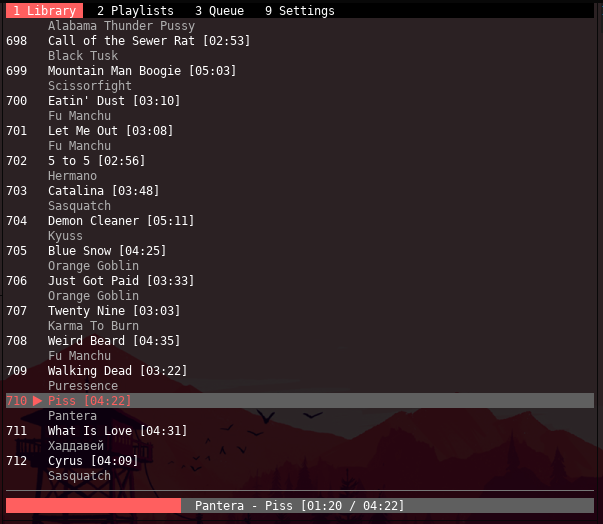

# Clay [alpha]

Standalone command line player for Google Play Music.

This app wouldn't be possible without the wonderful [gmusicapi] and [VLC] libraries.

This project is neither affiliated nor endorsed by Google.

It's being actively developed, but is still in the early alpha version, so many features are missing and/or may be bugged.

(Click the image below to see the screencast.)

[](https://asciinema.org/a/tV348AEpiuQbFzDmDH3hGpqHK)

# Requirements

- Python 3.x (native)
- [gmusicapi] (PYPI)
- [urwid] (PYPI)
- [PyYAML] (PYPI)
- lib[VLC] (native, distributed with VLC player)

# What works
- Playback
- Music library
- Playlists
- Queue
- Configuration
- Caching (partially)
- Basic error handling

# What is being developed

- Search
- Add to playlist
- Like/dislike
- Caching
- Other functionality that is supported by [gmusicapi]

# Installation

0. Install Python 3 and VLC.

## Method 1 (automatic)

1. Source the 'activate.sh' script. It will initialize the Python virtual env and install the dependencies:

    ```bash
    source activate.sh
    ```

2. Run the player:

    ```bash
    ./app.py
    ```

## Method 2 (manual)

1. Create & activate virtualenv:

    ```bash
    virtualenv .env
    source .env/bin/activate
    ```

2. Install the requirements:

    ```bash
    pip install -r requirements.txt
    ```

3. Run the player:

    ```bash
    ./app.py
    ```

# Configuration

In order to use this app, you need to know your Device ID. Typically gmusicapi should display possible IDs once you type a wrong one.
Also be aware that this app has not been tested with 2FA yet.

# Controls

- `<UP|DOWN|LEFT|RIGHT>` - nagivate around
- `<ALT> + 1..9` - switch active tab
- `<ENTER>` - play selected track
- `<CTRL> w` - play/pause
- `<CTRL> e` - play next song
- `<SHIFT> <LEFT|RIGHT>` - seek backward/forward by 5% of the song duration
- `<CTRL> s` - toggle shuffle
- `<CTRL> r` - toggle song repeat

# Credits

Made by Andrew Dunai.

Regards to [gmusicapi] and [VLC] who made this possible.

[gmusicapi]: https://github.com/simon-weber/gmusicapi
[VLC]: https://wiki.videolan.org/python_bindings
[urwid]: urwid.org/
[pyyaml]: https://github.com/yaml/pyyaml

