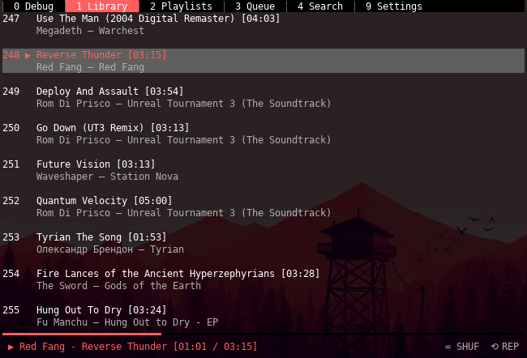

- [About](#clay-beta)
- [Quick start](#quick-start)
- [Documentation](#documentation)
- [Requirements](#requirements)
- [What works](#what-works)
- [What is being developed](#what-is-being-developed)
- [Installation](#installation)
  * [Method 1 (PyPi, automatic)](#method-1-pypi-automatic)
  * [Method 2 (from source, manual)](#method-2-from-source-manual)
  * [Method 3 (in Docker)](#method-3-in-docker)
- [Configuration](#configuration)
- [Controls](#controls)
  * [General](#general)
  * [Songs](#songs)
  * [Playback](#playback)
  * [Equalizer](#equalizer)
  * [Misc](#misc)
- [Troubleshooting](#troubleshooting)
- [Contributing](./CONTRIBUTING.rst)
- [Credits](#credits)
- [Changelog](./CHANGELOG.rst)

# Clay [beta]

[](https://travis-ci.org/and3rson/clay) [](http://clay.readthedocs.io/en/latest/?badge=latest) [](https://badge.fury.io/py/clay-player) [](https://codeclimate.com/github/and3rson/clay/maintainability)

Standalone command line player for Google Play Music.

This app wouldn't be possible without the wonderful [gmusicapi] and [VLC] & [MPV] libraries.

This project is neither affiliated nor endorsed by Google.

It's being actively developed, but is still in the early beta stage, so many features are missing and/or may be bugged.

We're on IRC!

- Server: irc.oftc.net
- Channel: **#clay**

Screenshot:



Click the image below to see the screencast:

[](https://asciinema.org/a/69ygwYGRDyB5a7pFgyrwWo1ea)

# Quick start

```bash
sudo apt install python-gi python-gi-cairo python3-gi python3-gi-cairo
vlc
pip install --user clay-player
clay
```

# Documentation

Documentation is [available here](http://clay.readthedocs.io/en/latest/).

# Requirements

- Python 3.x (native)
- [gmusicapi] (PyPI)
- [urwid] (PyPI)
- [PyYAML] (PyPI)
- lib[VLC] (native, distributed with VLC player) OR libMPV (native, distributed with MPV)
- [setproctitle] (optional) PyPI, used to change clay process name from 'python' to 'clay')
- [pydbus] (PyPI)
- [Pillow] (PyPI, optional) used to resize album art before displaying it in notifications

# What works
- Audio equalizer
- Caching (not for song data, that one is coming soon)
- Configurable keybinds and colours
- Configuration UI
- Filtering results
- Global hotkeys (via MPRIS2/DBus)
- Like/dislike tracks
- Liked songs playlist
- Music library browsing & management
- Notifications - in-app & OSD (via DBus)
- PyPI package
- Playback
- Playlists
- Queue management
- Radio stations
- I'm Feeling Lucky station
- Song file caching
- Song operations (add to library, start station etc.)
- Song search
- Token caching for faster authorizations

# What is being developed
- Artist/album display
- Artist/album search
- Other functionality that is supported by [gmusicapi]
- Playlist editing
- Different playback transports

# Installation

1. Install Python 3, pydbus, PyGObject, and VLC or MPV from your package manager.

## Method 1 (PyPi, automatic)

Just install the player using `pip`:

```bash
pip install --user clay-player
clay
```

## Method 2 (from source, manual)

1. Clone the source code.

2. Create & activate virtualenv with system packages:

    ```bash
    virtualenv --system-site-packages --prompt="(clay) " .env
    source .env/bin/activate
    ```

3. Install the requirements:

    ```bash
    pip install -r requirements.txt
    ```

4. Run the player:

    ```bash
    ./clay/app.py
    ```

## Method 3 (in Docker)

Sometimes you want to run stuff in Docker. You can run Clay in docker as well.

There are two strict requirements:

- You need to build the container by yourself (bacause of PulseAudio related paths & magic cookies.)
- You must have PulseAudio running on host with `module-native-protocol-tcp` module enabled.

Here's how you do it:

1. Clone the source code

2. Create "~/.config/clay" directory (to have proper volume permissions in docker)

    ```bash
    mkdir ~/.config/clay
    ```

3. Build & run the image

    ```bash
    make run
    ```

You *should* get the sound working. Also docker will reuse the Clay config file from host (if you have one).

# Remote control
Clay supports the MPRIS2 protocol which allows users to remote control their Clay instances using generic tools like [playerctl].
This replaces the old X Hotkeys systems but does require you to manually bind the keys to your windowing system of choice.

# Configuration

- Once you launch the app, use the "Settings" page to enter your login and password.
- You will also need to know your Device ID. Thanks to [gmusicapi], the app should display possible IDs once you enter a wrong one.
- Please be aware that this app has not been tested with 2FA yet.
- For people with 2FA, you can just create an app password in Google accounts page and proceed normally. (Thanks @j605)
- By default VLC is used. If you want to use MPV instead, add the following line to your Clay config file (`~/.config/clay/config.yaml`) in `clay_settings` section:

    ```yaml
    # ...
    clay_settings:
      player_class: clay.playback.mpv:MPVPlayer
    # ...
    ```

# Controls

## General

- `<UP|DOWN|LEFT|RIGHT>` - nagivate around
- `<ALT> + 0..9` - switch active tab

## Songs

- `<ENTER>` - add highlighted track to the queue
- `<CTRL> p` - start or pause the queue
- `<CTRL> w` - play/pause
- `<CTRL> e` - play next song
- `<CTRL> a` - append highlighted song to the queue
- `<CTRL> u` - remove highlighted song from the queue
- `<CTRL> p` - start station from highlighted song
- `<ALT> m` - show context menu for this song
- `<ALT> u` - thumb up the highlighted song
- `<ALT> d` - thumb down the highlighted song

## Playback

- `<CTRL> s` - toggle shuffle
- `<CTRL> r` - toggle song repeat
- `<SHIFT> <LEFT|RIGHT>` - seek backward/forward by 5% of the song duration
- `<CTRL> q` - seek to song beginning

## Equalizer
- `+` - increase amplification
- `-` - decrease amplification

## Misc

- `<ESC>` or `<CTRL> /` or <CTRL> _ - close most recent notification or popup
- `<CTRL> x` - exit app
- To filter songs just start typing words. Hit `<ESC>` to cancel.

# Troubleshooting

At some point, the app may fail. Possible reasons are app bugs,
Google Play Music API issues, [gmusicapi] bugs, [urwid] bugs etc.

If you encounter a problem, please feel free to submit an [issue](https://github.com/and3rson/clay/issues).
I'll try to figure it out ASAP.

Most issues can be reproduced only with specific data coming from Google Play Music servers.

Use "Debug" tab within app to select the error and hit "Enter" to copy it into clipboard.
This will help me to investigate this issue.

# Credits

Made by Andrew Dunai.

Regards to [gmusicapi] and [VLC] who made this possible.

People who contribute to this project:

- [@ValentijnvdBeek (Valentijn)](https://github.com/ValentijnvdBeek)
- [@Vale981 (Valentin Boettcher)](https://github.com/vale981)
- [@Fluctuz](https://github.com/Fluctuz)
- [@sjkingo (Sam Kingston)](https://github.com/sjkingo)
- [@agg23 (Adam Gastineau)](https://github.com/agg23)
- [@guitmz (Guilherme Thomazi Bonicontro)][https://github.com/guitmz]

[gmusicapi]: https://github.com/simon-weber/gmusicapi
[VLC]: https://wiki.videolan.org/python_bindings
[MPV]: https://mpv.io/
[urwid]: http://www.urwid.org/
[pyyaml]: https://github.com/yaml/pyyaml
[PyGObject]: https://pygobject.readthedocs.io/en/latest/getting_started.html
[Keybinder]: https://github.com/kupferlauncher/keybinder
[setproctitle]: https://pypi.org/project/setproctitle/
[pydbus]: https://github.com/LEW21/pydbus
[Pillow]: https://pillow.readthedocs.io/en/5.3.x/
